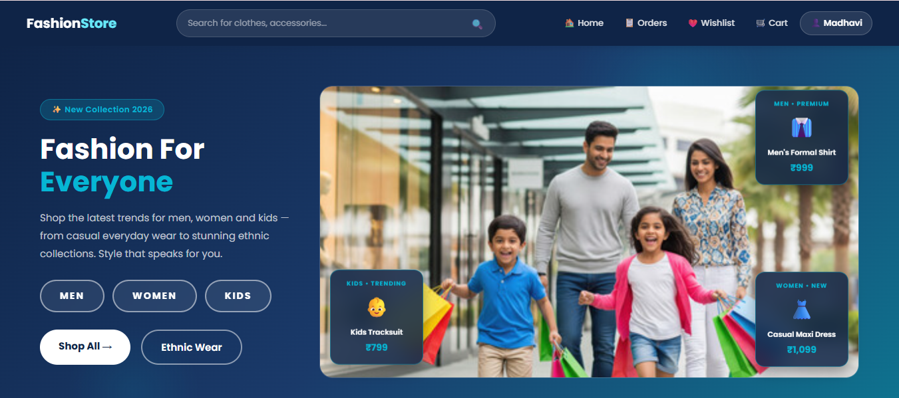
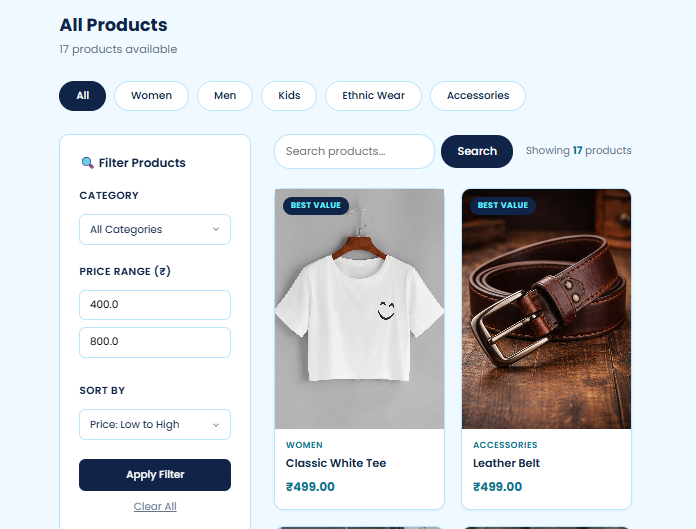
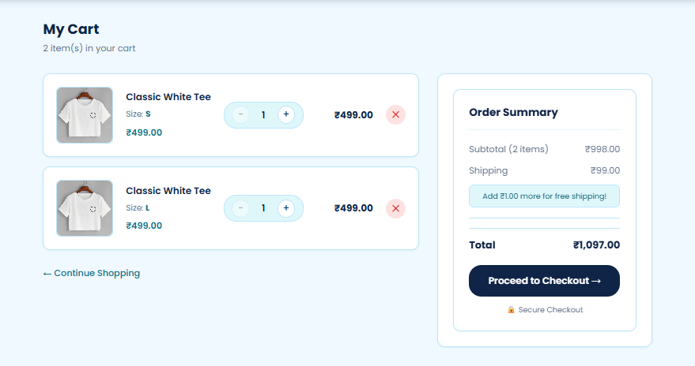
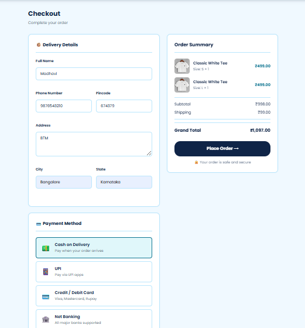
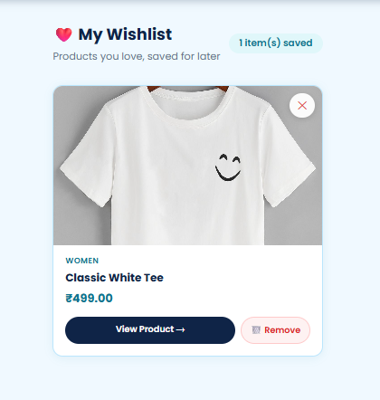
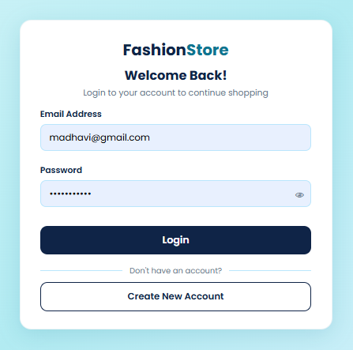
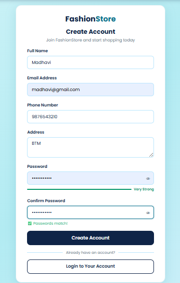

# 🛍️ FashionStore — Java Full Stack E-Commerce Web Application

A complete, fully-functional **Fashion E-Commerce Web Application** built 
from scratch using **Java Servlets, JSP, MySQL, and Apache Tomcat**.
Follows **MVC Design Pattern** with **DAO + DAOImpl** architecture.

---

## 🌐 Live Features

### 👤 User Features
- ✅ User Registration with BCrypt Password Hashing
- ✅ Secure Login / Logout with Session Management
- ✅ User Profile Management
- ✅ Browse Products by Category (Women, Men, Kids, Ethnic Wear, Accessories)
- ✅ Search Products by Name / Description
- ✅ Filter Products by Category + Price Range
- ✅ Sort Products (Price Low-High, High-Low, Name A-Z, Z-A)
- ✅ Product Detail with Size Selection + Stock Info
- ✅ Add to Cart / Update Quantity / Remove from Cart
- ✅ Checkout with Delivery Address + Payment Options
- ✅ Order Placement + Order Confirmation
- ✅ Order History
- ✅ Order Tracking with Visual Progress Bar
- ✅ Wishlist — Add / Remove / View

### 🔧 Admin Features
- ✅ Admin Dashboard — Total Products, Orders, Users, Revenue
- ✅ Product Management — Add, Edit, Delete (Soft Delete)
- ✅ Order Management — View All Orders + Update Status
- ✅ User Management — View All Registered Users

### 🎨 UI Features
- ✅ Ocean Blue Theme — Professional & Clean Design
- ✅ Fully Responsive Layout
- ✅ JavaScript Form Validations
- ✅ Password Strength Meter
- ✅ Real-time Field Error Messages
- ✅ Product Image Gallery
- ✅ Order Tracking Progress Bar with Animations

---

## 🔧 Tech Stack

| Layer | Technology |
|---|---|
| **Language** | Java 21 |
| **Backend** | Jakarta Servlets (Jakarta EE 5.0) |
| **Frontend** | JSP, JSTL, HTML5, CSS3, JavaScript |
| **Database** | MySQL 8.0 |
| **Server** | Apache Tomcat 10.1 |
| **Build Tool** | Maven |
| **Security** | BCrypt Password Hashing (jBCrypt) |
| **IDE** | Eclipse IDE |
| **Design Pattern** | MVC (Model-View-Controller) |
| **DB Pattern** | DAO + DAOImpl |

---

## 🗄️ Database Schema

fashion_store/
├── users (user accounts)
├── categories (product categories)
├── products (product catalog)
├── product_variants (sizes + stock)
├── cart (user cart)
├── cart_items (items in cart)
├── orders (placed orders)
├── order_items (items in each order)
└── wishlist (saved products)


---

## 📁 Project Structure

FashionStore/
├── src/main/java/
│ ├── com.fashionstore.controller/ ← Servlets (MVC Controllers)
│ │ ├── HomeController.java
│ │ ├── UserController.java
│ │ ├── ProductController.java
│ │ ├── CartController.java
│ │ ├── OrderController.java
│ │ ├── WishlistController.java
│ │ └── AdminController.java
│ ├── com.fashionstore.dao/ ← DAO Interfaces
│ │ ├── UserDAO.java
│ │ ├── ProductDAO.java
│ │ ├── CategoryDAO.java
│ │ ├── CartDAO.java
│ │ ├── OrderDAO.java
│ │ ├── WishlistDAO.java
│ │ └── AdminDAO.java
│ ├── com.fashionstore.daoimpl/ ← DAO Implementations (JDBC)
│ ├── com.fashionstore.model/ ← Java Bean Classes
│ ├── com.fashionstore.filter/ ← Encoding Filter
│ └── com.fashionstore.util/ ← DBConnection, PasswordUtil
│
├── src/main/webapp/
│ ├── assets/
│ │ ├── css/ ← Stylesheets
│ │ ├── js/ ← JavaScript
│ │ └── images/ ← Product Images
│ ├── WEB-INF/
│ │ ├── views/
│ │ │ ├── user/ ← Login, Register, Profile
│ │ │ ├── product/ ← Product List, Detail
│ │ │ ├── cart/ ← Cart Page
│ │ │ ├── order/ ← Checkout, Success, History, Tracking
│ │ │ ├── wishlist/ ← Wishlist Page
│ │ │ ├── admin/ ← Admin Panel Pages
│ │ │ └── error/ ← 404, 500 Pages
│ │ ├── partials/ ← Navbar, Footer
│ │ └── web.xml
│ └── index.jsp
└── pom.xml


---

## 🚀 How to Run Locally

### Prerequisites
- Java 21 installed
- Apache Tomcat 10.1 installed
- MySQL 8.0 installed
- Eclipse IDE with Maven support
- Git

### Steps

**1. Clone the repository**
```bash
git clone https://github.com/YOUR_USERNAME/FashionStore.git
```

**2. Import into Eclipse**

File → Import → Maven → Existing Maven Projects
Browse to cloned folder → Finish


**3. Setup Database**
```sql
-- Run the SQL script in MySQL Workbench
source schema.sql
```

**4. Configure DB Connection**

Open `src/main/java/com/fashionstore/util/DBConnection.java`:
```java
private static final String URL = 
    "jdbc:mysql://localhost:3306/fashion_store";
private static final String USER = "root";
private static final String PASSWORD = "your_mysql_password"; 
// ← change this
```

**5. Maven Update**

Right click project → Maven → Update Project (Alt+F5)


**6. Deploy on Tomcat**

Right click project → Run As → Run on Server
Select Tomcat 10.1 → Finish


**7. Open Browser**

http://localhost:8080/FashionStore/home


**8. Admin Login**
```sql
-- Set yourself as admin in MySQL
UPDATE users SET is_admin = TRUE 
WHERE email = 'your_email@gmail.com';
```
Then visit: `http://localhost:8080/FashionStore/admin`

---

## 📸 Screenshots

| Page | Screenshot |
|---|---|
| Home |  |
| Products |  |
| Product Detail |  |
| Cart |  |
| Checkout |  |
| Order Tracking |  |
| Wishlist |  |
| Admin Dashboard |  |
| Login |  |
| Register |  |

---

## 🎯 Key Learning Outcomes

✅ MVC Design Pattern implementation
✅ DAO + DAOImpl Pattern for database abstraction
✅ JDBC for database operations
✅ Session Management for user authentication
✅ BCrypt for secure password hashing
✅ JSTL and EL expressions in JSP
✅ Form validation (client-side JS + server-side Java)
✅ File upload handling (product images)
✅ Soft delete pattern for products
✅ Batch processing for order items
✅ CSS custom properties (variables) for theming
✅ Responsive web design


---

## 👩‍💻 Developer

**Madhavi**
Java Full Stack Trainee | TAP Academy, Bengaluru

[](https://linkedin.com/in/madhavi-gurram)
[](https://github.com/Madhavi-Gurram)

---

## 📄 License

This project is created for educational purposes as part of 
Java Full Stack Training at TAP Academy.

---

⭐ If you found this project helpful, please give it a star!
